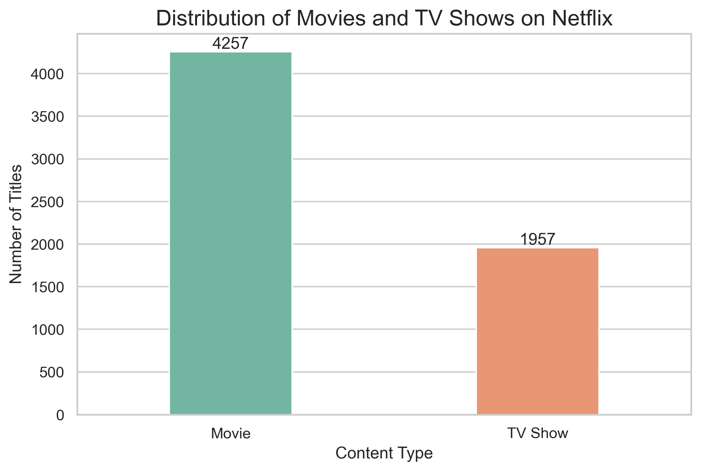
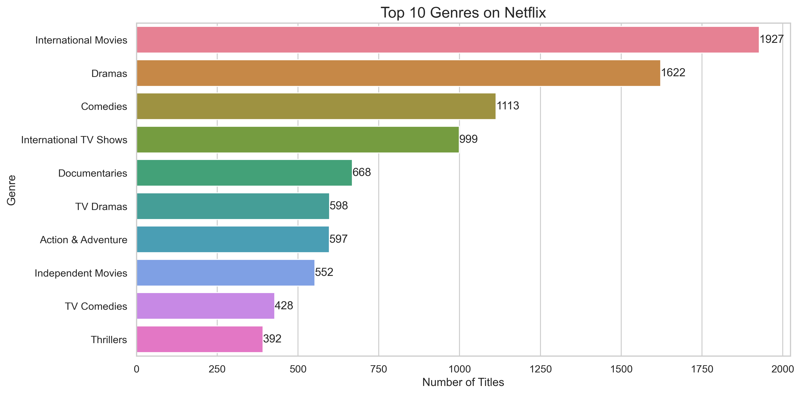
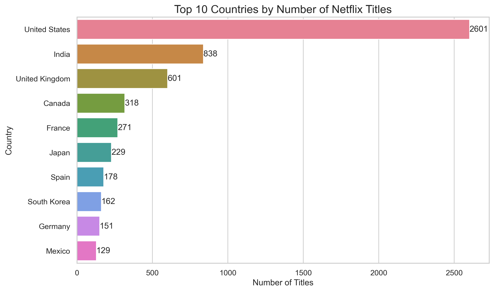
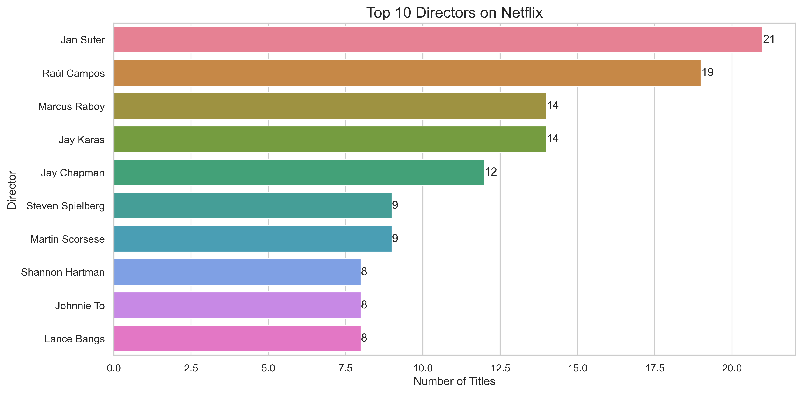

# Netflix-Content-Analysis

<p align="center">
  
</p>

<h1 align="center">📺 Netflix Content Analysis</h1>

<p align="center">
A complete Exploratory Data Analysis (EDA) project that uncovers trends in Netflix's global content library using Python.
</p>

<p align="center">


</p>

---

# 📌 Project Overview

Netflix has become one of the world's largest streaming platforms, offering thousands of movies and TV shows across different countries and genres.

This project performs **Exploratory Data Analysis (EDA)** on the Netflix Titles dataset to discover patterns in content type, release years, genres, countries, ratings, directors, actors, and movie duration. The project concludes with business insights and recommendations based on the analysis.

---

# 🎯 Business Objectives

- Compare Movies vs TV Shows
- Analyze Netflix's content growth over time
- Discover the top content-producing countries
- Identify the most popular genres
- Analyze audience ratings
- Study movie duration trends
- Find the most featured directors
- Find the most featured actors
- Generate business insights from the data

---

# 🛠️ Technologies Used

- Python
- Pandas
- NumPy
- Matplotlib
- Seaborn
- Jupyter Notebook

---

# 📂 Dataset Information

| Attribute | Value |
|-----------|-------|
| Dataset | Netflix Titles |
| Records | 8,807 |
| Features | 12 |
| Source | Kaggle |

---

# 🔄 Project Workflow

1. Data Collection
2. Data Understanding
3. Data Cleaning
4. Exploratory Data Analysis
5. Data Visualization
6. Business Insights
7. Recommendations
8. Conclusion

---

# 📈 Exploratory Data Analysis

The project includes analysis of:

- Movies vs TV Shows
- Release Year Distribution
- Top Producing Countries
- Top Genres
- Content Ratings
- Movie Duration
- Monthly Content Added
- Movies vs TV Shows by Country
- Top 10 Directors
- Top 10 Actors

---

# 📊 Project Visualizations

## Movies vs TV Shows

<p align="center">

</p>

---

## Top Genres

<p align="center">

</p>

---

## Top Producing Countries

<p align="center">

</p>

---

## Top Directors

<p align="center">

</p>

---

# 💡 Key Insights

- Movies significantly outnumber TV Shows on Netflix.
- Netflix's content library expanded rapidly after 2015.
- The United States and India contribute the highest number of titles.
- International Movies and Dramas dominate the platform.
- Most movies have durations between 80–120 minutes.
- TV-MA is the most common content rating, indicating a strong adult audience.

---

# 🚀 Future Improvements

- Build a Movie Recommendation System
- Perform Sentiment Analysis on movie descriptions
- Develop an interactive Streamlit dashboard
- Compare Netflix with Amazon Prime and Disney+

---

# 📁 Repository Structure

```text
Netflix-Content-Analysis/
│
├── Netflix_Content_Analysis.ipynb
├── README.md
├── requirements.txt
│
├── dataset/
│   └── netflix_titles.csv
│
└── images/
    ├── banner.png
    ├── movies_vs_tvshows.png
    ├── release_year_analysis.png
    ├── top_producing_countries.png
    ├── top_genres.png
    ├── top_directors.png
    └── top_actors.png
```

---

# 👨‍💻 Author

**Satyam Singh**

B.Tech in Artificial Intelligence & Machine Learning  
VIT Bhopal University

⭐ If you found this project interesting, consider giving it a star!
